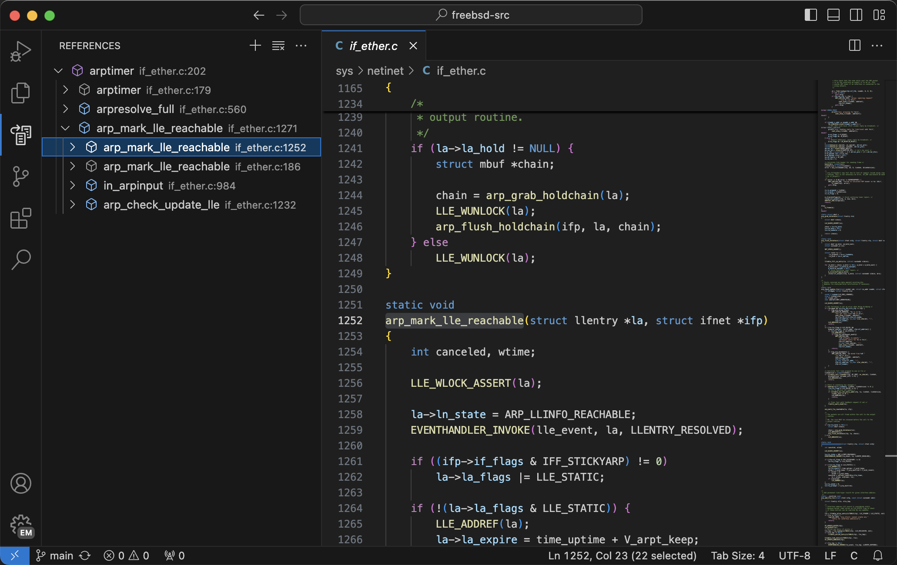

# References VS Code Extension

## Overview

The **References** extension for Visual Studio Code provides a powerful tool for searching and managing code references within your workspace. It leverages GNU Global and Universal Ctags to offer comprehensive symbol reference searching and completion features.

## Features

- **Reference Search**: Quickly find references to symbols in your codebase.
- **Tree View**: Visualize references in a structured tree view.
- **Command Palette Integration**: Easily access commands via the VS Code command palette.
- **Keyboard Shortcuts**: Use `Ctrl+Alt+R` (or `Cmd+R` on macOS) to list references.

## Installation

1. Ensure you have [GNU Global](https://www.gnu.org/software/global/) and [Universal Ctags](https://ctags.io/) installed on your system.
2. Install the extension from the VS Code Marketplace or by downloading and installing the `.vsix` file.

## Usage

1. **Activate the Extension**: The extension activates automatically when you open a workspace.
2. **Search References**: Use the command `References: List References` from the command palette or the keyboard shortcut to search for references of the selected symbol.
3. **Add/Remove Items**: Use the `References: Add` and `References: Remove` commands to manage your reference list.
4. **Clear Items**: Use the `References: Clear` command to clear all items from the reference list.

## Configuration

You can configure the extension settings in your `settings.json` file:

- `references.globalExecutable`: Path to the GNU Global executable.
- `references.ctagsExecutable`: Path to the Universal Ctags executable.
- `references.completion`: Enable or disable the auto-completion feature.

## Development

To contribute to the development of this extension:

1. Clone the repository: `git clone https://github.com/yliu/vscode-references.git`
2. Install tools: refer to https://code.visualstudio.com/api/get-started/your-first-extension
3. Click `Run` -> `Run and Debug` to debug the extension.
4. Use `vsce package` to build the extension

## License

This project is licensed under the MIT License. See the [LICENSE](LICENSE.md) file for details.

## Contributing

Contributions are welcome! Please submit issues and pull requests for any improvements or bug fixes.

## Acknowledgments

- [GNU Global](https://www.gnu.org/software/global/)
- [Universal Ctags](https://ctags.io/)